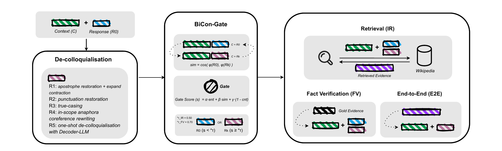

# BiCon-Gate

Core experimental code for **[BiCon-Gate: Consistency-Gated De-colloquialisation for Dialogue Fact-Checking](https://aclanthology.org/2026.fever-1.5/)**, published at FEVER 2026.

Dialogue claim rewriting can improve evidence retrieval, but an incorrect rewrite can change the claim's meaning and hurt verification. **BiCon-Gate** selects a de-colloquialised rewrite only when it is semantically consistent with the dialogue; otherwise, it falls back to the original claim.

<p align="center">
  
</p>
<p align="center"><em>Staged de-colloquialisation, BiCon-Gate routing, and IR/FV/E2E evaluation.</em></p>

On DialFact, scoped pronoun rewriting improves retrieval across sparse, dense, and cross-encoder stages. With BiCon-Gate, FV-only macro-F1 improves by **1.84 points** and top-1 end-to-end macro-F1 by **0.62 points** over the original claim.

## Repository

```text
src/
├── data_preprocess.py
├── modeling.py
├── training.py
├── bicon_gate.py
├── retrieval.py
└── evaluation.py
```

## Setup

```bash
python -m venv .venv
source .venv/bin/activate
python -m pip install \
  torch transformers sentence-transformers \
  deepmultilingualpunctuation maverick-coref

export PYTHONPATH="$PWD/src:$PYTHONPATH"
```

DialFact data, model weights, and Wikipedia indexes are not included. Download DialFact from its [official repository](https://github.com/salesforce/DialFact). Retrieval additionally requires Pyserini and a compatible Wikipedia Lucene index.

## Example

```bash
python - <<'PY'
from bicon_gate import BiConGate, TAU_FV
from modeling import E5Encoder, GateNLI

gate = BiConGate(GateNLI(), E5Encoder())
result = gate.score(
    context=["Previous dialogue turn"],
    original_claim="Original response",
    rewritten_claim="Rewritten response",
    threshold=TAU_FV,
)
print(result)
PY
```

## Citation

```bibtex
@inproceedings{park-zubiaga-2026-bicon,
  title     = {{B}i{C}on-Gate: Consistency-Gated De-colloquialisation for Dialogue Fact-Checking},
  author    = {Park, Hyunkyung and Zubiaga, Arkaitz},
  booktitle = {Proceedings of the Ninth Fact Extraction and VERification Workshop (FEVER)},
  year      = {2026},
  pages     = {59--73},
  url       = {https://aclanthology.org/2026.fever-1.5/}
}
```
